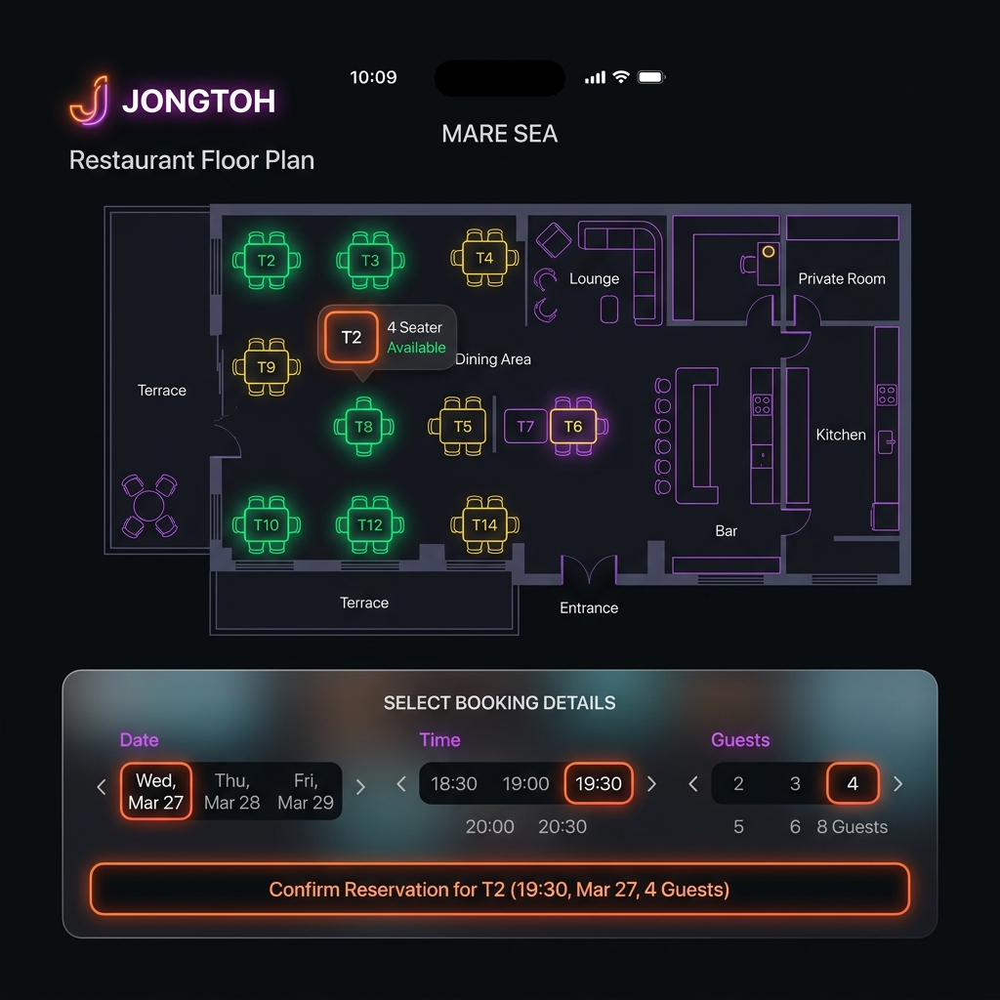
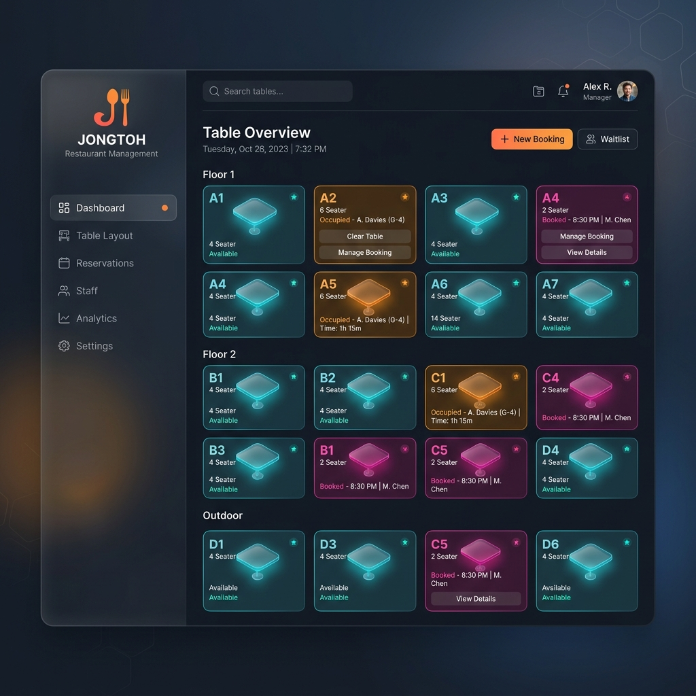

# JONGTOH - Requirements & Features List (PRD)

เอกสารฉบับนี้รวบรวมความต้องการของระบบ (Requirements) และฟีเจอร์หลัก (Features) ของระบบจองโต๊ะร้านอาหาร **JONGTOH** เพื่อใช้ในการอ้างอิงและรีวิวร่วมกับ User

---

## 1. User Application (ระบบสำหรับลูกค้า)

**เป้าหมาย:** เพื่อให้ลูกค้าสามารถดูสถานะโต๊ะและทำการจองได้อย่างรวดเร็วแบบ Real-time โดยไม่เกิดการจองซ้ำซ้อน

### ฟีเจอร์หลัก (Features):
- **Interactive Floor Plan:** หน้าจอแสดงแผนผังโต๊ะของร้านอาหาร โดยมีการแบ่งสีตามสถานะชัดเจน (เช่น ว่าง, กำลังจอง, ไม่ว่าง)
- **Real-time Availability:** อัปเดตสถานะของโต๊ะแบบทันทีทันใด (Real-time) โดยไม่ต้องรีเฟรชหน้าจอ (ผ่าน WebSocket)
- **Optimistic UI Reservation:** เมื่อกดจอง ระบบจะแสดงผลตอบรับทันทีเพื่อประสบการณ์ใช้งานที่ลื่นไหล
- **Concurrency Handling:** รองรับลูกค้าจำนวนมากที่เข้ามาแย่งจองโต๊ะเดียวกันในเวลาเดียวกัน โดยระบบจะป้องกันการจองซ้ำ (Double Booking) อย่างเด็ดขาด (ทำงานอยู่เบื้องหลังด้วย Redis Lock และ RabbitMQ)
- **ระบบเลือกวัน เวลา และจำนวนที่นั่ง:** ต้องแสดงปฏิทินและช่วงเวลาที่ยังว่างอยู่ชัดเจน
- **ช่องระบุความต้องการพิเศษ:** สำหรับให้ระบุเพิ่มเติม เช่น แพ้อาหาร ต้องการวีลแชร์ หรือขอเก้าอี้เด็ก
- **ฟอร์มกรอกข้อมูลผู้จอง:** เก็บข้อมูลเท่าที่จำเป็น เช่น ชื่อ เบอร์โทรศัพท์ และอีเมล
- **UI Booking Rules:** มีระบบป้องกันการกดจองหลายโต๊ะพร้อมกันสำหรับลูกค้าคนเดียว (เช็คผ่าน Device ID และแสดงผล UI โต๊ะอื่นเป็นสีเทา กดจองซ้ำไม่ได้)

---

## 2. Admin Dashboard (ระบบสำหรับผู้ดูแลร้าน)

**เป้าหมาย:** เพื่อให้พนักงานหรือผู้จัดการร้านสามารถจัดการสถานะโต๊ะและดูแลการจองได้อย่างมีประสิทธิภาพ

### ฟีเจอร์หลัก (Features):
- **Real-time Table Monitoring:** หน้าจอ Dashboard สำหรับดูสถานะโต๊ะทั้งหมดในร้านแบบ Real-time จัดเรียงอย่างเป็นระเบียบ
- **Table Management:** พนักงานสามารถกด **"Clear Table"** (เคลียร์โต๊ะ) เพื่อเปลี่ยนสถานะโต๊ะจากที่ลูกค้านั่งอยู่ (Occupied) ให้กลับมาเป็นโต๊ะว่าง (Available) พร้อมรับลูกค้ากลุ่มต่อไป
- **Booking Details View:** มีตารางแสดงประวัติและรายละเอียดการจองล่าสุด (เวลาจอง, รหัสการจอง, ชื่อลูกค้า, เบอร์โทร, อีเมล, ความต้องการพิเศษ) เพื่อให้แอดมินดูข้อมูลลูกค้าได้ทันที
- **Dynamic Frontend Title:** สลับเปลี่ยนชื่อ Tab (Title) ของหน้าเว็บระหว่าง "frontend" (หน้าลูกค้า) และ "backend" (หน้าแอดมิน) ตามหน้าจอการใช้งานโดยอัตโนมัติ
- **System Metrics (Optional):** แสดงสถานะการเชื่อมต่อของระบบหลังบ้าน (เช่น RabbitMQ, WebSocket)

---

## 3. Non-Functional Requirements (NFR)
- **High Concurrency & Performance:** ระบบต้องสามารถรองรับ High Traffic หรือ Request จำนวนมากพร้อมกันได้ในช่วงเวลาเร่งด่วน โดยคิวไม่หลุด
- **Data Integrity:** ข้อมูลการจองต้องมีความถูกต้อง 100% ไม่มีกรณีโต๊ะเดียวถูกจองซ้อนกัน
- **Premium UX/UI Design:** การออกแบบต้องมีความทันสมัย (Modern Design), ใช้โทนสีระดับพรีเมียม (Dark Mode พร้อมสี Accent สะดุดตา), มีการใช้ Glassmorphism และ Animation ที่นุ่มนวล
- **Responsive:** รองรับการใช้งานทั้งบนโทรศัพท์มือถือ (ลูกค้า) และคอมพิวเตอร์/แท็บเล็ต (แอดมิน)

---

## 4. UI/UX Mockups (สำหรับการรีวิว)

### 4.1 หน้าจอสำหรับลูกค้าจองโต๊ะ (User Application)
> [!NOTE]
> ออกแบบมาเพื่อเน้นการจองที่รวดเร็ว (Quick Booking) โทนสีเข้มพรีเมียม มีแผนผังโต๊ะชัดเจน

---

### 4.2 หน้าจอสำหรับแอดมิน (Admin Dashboard)
> [!NOTE]
> ออกแบบสำหรับจัดการโต๊ะโดยรวม เน้นความชัดเจนของสถานะ (สีแดง/เขียว/เหลือง) และมีปุ่ม Action ที่กดง่าย

---

## 5. Future Development Roadmap (แผนการพัฒนาในอนาคต)

เพื่อรองรับการเติบโตของธุรกิจร้านอาหาร นี่คือแผนการพัฒนาฟีเจอร์ขั้นสูงที่สามารถต่อยอดได้ในเฟสถัดไป:

### 5.1 Time-slot Based Booking (การจองแบบระบุช่วงเวลาทับซ้อนไม่ได้)
เปลี่ยนจากการล็อคสถานะโต๊ะแบบเหมารวม (Occupied/Reserved) เป็นการคำนวณความว่างของโต๊ะจาก **เวลา (Time-slot)** แทน:
- **Dynamic Frontend Availability:** โต๊ะจะแสดงผลว่า "ว่าง" หรือ "ไม่ว่าง" ตาม **วันที่และเวลา** ที่ลูกค้าเลือกบนปฏิทินหน้าเว็บ (ไม่ใช่สถานะคงที่)
- **Time Overlap Validation (Backend):** ระบบจะตรวจสอบ Query ใน Database ว่าช่วงเวลาที่กำลังจะจอง (เช่น 18:00 - 19:30) มีการทับซ้อนกับประวัติการจองเดิมของโต๊ะนั้นหรือไม่ หากไม่ทับซ้อนก็สามารถจองได้ แม้โต๊ะนั้นจะถูกจองในเวลา 12:00 ไปแล้วก็ตาม
- **Turnaround Time Management:** รองรับการตั้งค่าเวลาการนั่งทาน (เช่น โต๊ะละ 1.5 - 2 ชั่วโมง) และเผื่อเวลาเคลียร์โต๊ะ (Buffer time) 15 นาทีระหว่างรอบ

### 5.2 Admin Features Enhancement
- **Booking History & Export:** แอดมินสามารถดูประวัติการจองย้อนหลัง กรองข้อมูลตามช่วงเวลา และ Export เป็นไฟล์ CSV/Excel ได้
- **Table Merge/Split:** รองรับกรณีลูกค้ามากลุ่มใหญ่ และต้องการนำโต๊ะ 2 ตัวมาต่อกัน (Merge Tables)
- **Analytics Dashboard:** สรุปสถิติช่วงเวลาที่มีลูกค้าแน่นที่สุด (Peak Hours) หรือโต๊ะยอดนิยม เพื่อใช้ทำการตลาด
